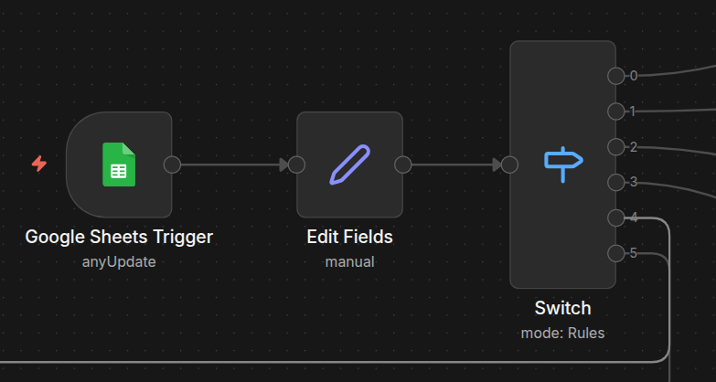
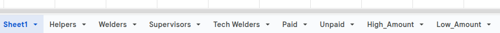
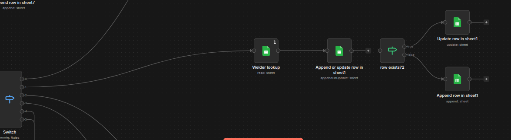

# n8n Workflow – Employee & Payment Automation System

## 1. What is n8n? (Simple Explanation)

n8n is an **automation and workflow orchestration tool**.

In simple terms:
- It connects different systems (web apps, APIs, databases, sheets, AI models)
- Executes logic based on events
- Automates tasks that would normally require backend code

Instead of writing a traditional backend with controllers, services, and cron jobs:
- **n8n becomes the backend**
- Each workflow acts like an API + business logic layer  

In this system:
- Web app = UI layer only
- n8n = backend brain
- Google Sheets = lightweight database

---

## 2. What This Workflow Is About (High-Level)

This workflow is an **automation-first employee and payment management system** designed for construction companies.

Instead of manual registers or Excel files:
- All operations flow through n8n
- Data is validated, stored, calculated, and returned automatically

### Core idea
> **Single source of truth + event-driven automation**

No manual calculations.  
No direct database access.  
Everything goes through workflows.

---

## 3. Problem This Workflow Solves

Construction companies usually face:
- Manual employee tracking
- Payment calculation errors
- Delayed salary processing
- No real-time visibility into expenses

This workflow replaces:
- Registers
- Manual Excel formulas
- Human-dependent calculations

With:
- Automated logic
- Structured storage
- Real-time responses

---

### Google Sheets Trigger → Edit Fields → Switch

- **Google Sheets Trigger**  
  This node listens to the **master Google Sheet** and triggers the workflow **whenever any data is added, updated, or modified**.  
  It acts as the main entry point for all changes in the system.

- **Edit Fields (Set Node)**  
  Incoming data from Sheets can be messy or inconsistent.  
  This node reshapes and normalizes the data into a **fixed schema**, ensuring downstream nodes always receive clean and structured fields.

- **Switch Node**  
  The Switch node evaluates rules and **routes the data to different workflow branches** based on conditions.  
  This allows a single workflow to handle multiple operations without duplicating logic.

**MASTER DATA**
- > This Google Sheet acts as the **master data source** for all employees and payments.  
Any change made here is **automatically synchronized to relevant sub-sheets** through n8n workflows, ensuring real-time consistency across the system.
- 

**SUB SHEETS**
- > These are **auto-managed sub-sheets** derived from the master sheet.  
Based on role, payment status, and amount rules, n8n automatically **updates each sub-sheet in real time** whenever the master data changes.

- 

## APPEND DATA IN SUB-SHEETS

- > Once the Switch node routes the data, each branch handles its own logic independently.  
The **Helper/Welder/Supervisor lookup** node checks whether the record already exists in the master sheet; if it does, the data is **appended or updated in the corresponding sub-sheet**, ensuring clarity, consistency, and proper **error handling**.

- > All other sub-sheets follow the **same workflow pattern**.  
Once routed by the Switch node, each branch performs lookup, validation, and append/update operations to keep every sub-sheet synchronized with the master data.

--- 

### Final Note

This workflow is a **reference implementation** to demonstrate how complex-looking systems can drastically reduce manual work when broken down into smart automations.  
What seems heavy and complicated on the surface is actually **easy to maintain, scalable, and efficient** once automation takes over.

Less human effort, fewer mistakes, more time for real work.

Built with ❤️, logic, and a bit of chaos —  
**bugOpsX** 🐞⚙️  
_“If it can be automated, it should be.”_
