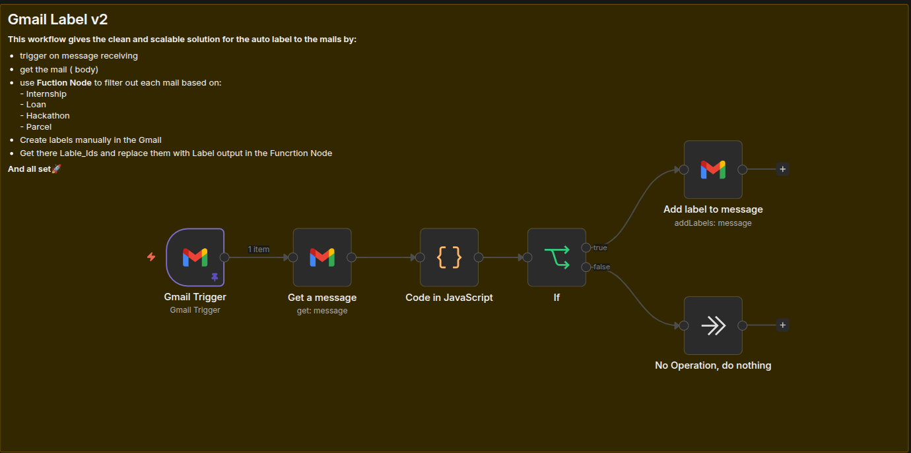
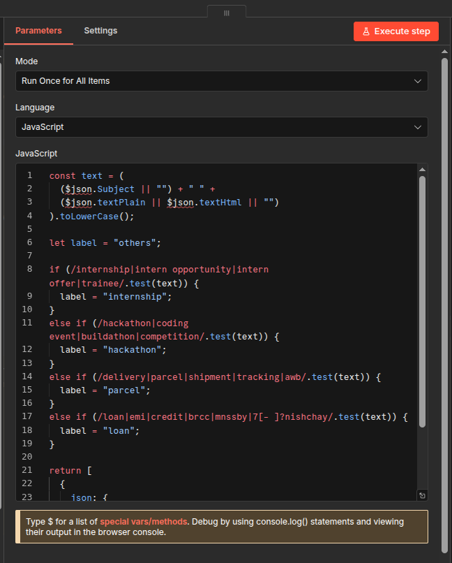
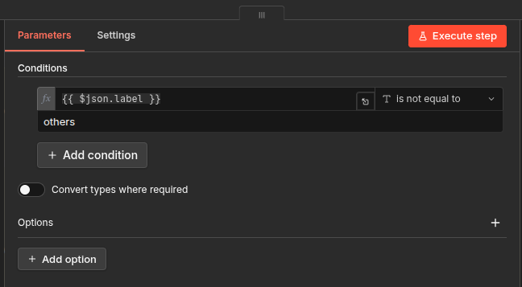

# 📧 Gmail Label v2 — Step-by-Step Guide (n8n)

> **What's new in v2?**  
> Instead of a Switch node with 4 separate outputs, v2 uses a **JavaScript Code node** to decide the label in one place — cleaner, faster, and easier to scale.

---

## 🗺️ Workflow Overview



```
Gmail Trigger → Get a Message  → Code in JavaScript → If → Add label / No Operation
```

| # | Node | Purpose |
|---|------|---------|
| 1 | Gmail Trigger | Fires on every new email |
| 2 | Get a Message | Fetches full email content |
| 3 | Code in JavaScript | Decides which label to apply |
| 4 | If | Skips unmatched emails |
| 5 | Add label to message | Applies the Gmail label |
| 6 | No Operation, do nothing | Graceful exit for unmatched emails |

---

## ✅ Prerequisites

- n8n instance running (self-hosted or cloud)
- **Gmail OAuth2** credential set up in n8n
- Four labels created in Gmail: `internship`, `hackathon`, `parcel`, `loan`
- Their **Label IDs** noted down (e.g. `Label_258582...`)

---

## Step 1 — 🆕 Create a New Workflow

1. Open n8n → Click **"New Workflow"**
2. Name it `auto-label-v2`
3. Click **Save**

---

## Step 2 — ⚡ Gmail Trigger Node

1. Add node → search **"Gmail Trigger"**
2. Set:
   - **Credential:** your Gmail OAuth2 account
   - **Poll Times:** `Every Minute`
   - **Filters:** leave empty
3. Save the node

---

## Step 3 — 📨 Get a Message Node

1. Add node → search **"Gmail"**
2. Set:
   - **Resource:** `Message`
   - **Operation:** `Get`
   - **Message ID:** `={{ $json.id }}`
3. Rename to `Get a message` → Save

---

## Step 4 — 🧠 Code in JavaScript Node

This is the core of v2. One node handles all the label logic.



1. Add node → search **"Code"**
2. Set **Mode** to `Run Once for All Items`
3. Set **Language** to `JavaScript`
4. Paste this code:

```javascript
const text = (
  ($json.Subject || "") + " " +
  ($json.textPlain || $json.textHtml || "")
).toLowerCase();

let label = "others";

if (/internship|intern opportunity|intern offer|trainee/.test(text)) {
  label = "Label_XXXXXXXXXXXXXXXXXXX";  // 👈 replace with your Label ID
} 
else if (/hackathon|coding event|buildathon|competition/.test(text)) {
  label = "Label_XXXXXXXXXXXXXXXXXXX";  // 👈 replace with your Label ID
} 
else if (/delivery|parcel|shipment|tracking|awb/.test(text)) {
  label = "Label_XXXXXXXXXXXXXXXXXXX";  // 👈 replace with your Label ID
} 
else if (/loan|emi|credit|brcc|mnssby|7[- ]?nishchay/.test(text)) {
  label = "Label_XXXXXXXXXXXXXXXXXXX";  // 👈 replace with your Label ID
}

return [{ json: { id: $json.id, label } }];
```

> 💡 Replace each `Label_...` value with your actual Gmail Label IDs. If no keyword matches, label stays as `"others"`.

5. Rename to `Code in JavaScript` → Save

---

## Step 5 — 🔀 If Node

Filters out emails that didn't match any category — no unnecessary label calls.



1. Add node → search **"If"**
2. Set the condition:
   - **Left Value:** `={{ $json.label }}`
   - **Operator:** `is not equal to`
   - **Right Value:** `others`
3. Save the node

> ✅ **True** path → email matched a category → apply label  
> ❌ **False** path → unmatched email → do nothing

---

## Step 6 — 🏷️ Add Label to Message Node

![Gmail Label NodeXXXXXXXXXXXXXXXXXXXgmail-label-node.png)

1. Add node from the **true** output of If → search **"Gmail"**
2. Set:
   - **Credential:** Gmail OAuth2 account
   - **Resource:** `Message`
   - **Operation:** `Add Label`
   - **Message ID:** `={{ $json.id }}`
   - **Label Names or IDs:** `={{ [$json.label] }}`
3. Rename to `Add label to message` → Save

> 🔑 The label ID comes dynamically from the Code node output — no hardcoding needed here!

---

## Step 7 — ⏭️ No Operation Node

1. Add node from the **false** output of If → search **"No Operation"**
2. No configuration needed
3. Rename to `No Operation, do nothing` → Save

---

## Step 8 — 🔗 Verify Connections

```
Gmail Trigger
    └──► Get a Message
              └──► Code in JavaScript
                        └──► If
                              ├── true  ──► Add label to message
                              └── false ──► No Operation, do nothing
```

---

## Step 9 — 🧪 Test the Workflow

1. Click **"Execute Workflow"**
2. Send yourself a test email with subject `"Loan Approved"`
3. The **true** path should highlight → check Gmail for the label ✅

---

## Step 10 — 🟢 Activate

Toggle **Active** ON — the workflow now runs every minute automatically 🚀

---

---

# ⚖️ v1 vs v2 — Which is Better?

| Feature | v1 (Switch Node) | v2 (JS Code Node) |
|---|---|---|
| 🧩 **Architecture** | 4 separate output branches | Single node, one output |
| ➕ **Adding a new category** | New Switch rule + new Gmail node | One new `else if` block in JS |
| 🏷️ **Label nodes** | 4 separate Gmail nodes | 1 shared Gmail node |
| 🔍 **Readability** | More visual, more cluttered | Compact and clean |
| 🛡️ **Unmatched emails** | Falls through Switch silently | Explicitly handled by If node |
| 🧠 **Logic location** | Split across Switch conditions | All in one JS function |

### 🏆 Why v2 Wins

> **v2 is cleaner and more scalable.** In v1, adding a 5th category means adding a new Switch rule *and* a new Gmail node. In v2, you just add one `else if` line in the JavaScript. The single `Add label to message` node handles all categories dynamically — making the canvas easier to read and the workflow easier to maintain.

---

*Built with n8n · Gmail OAuth2 · JavaScript*
