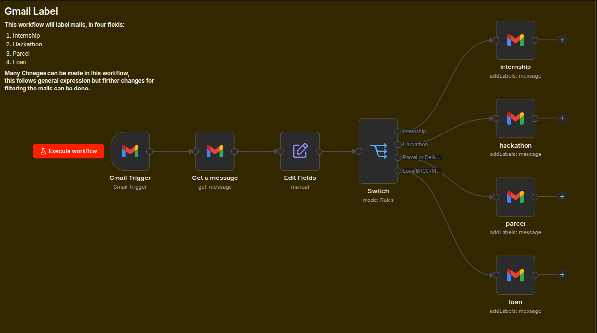
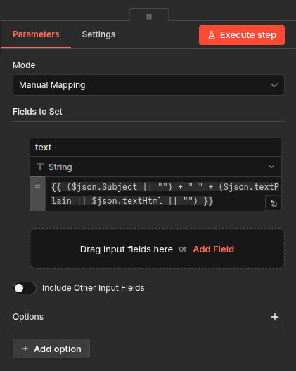
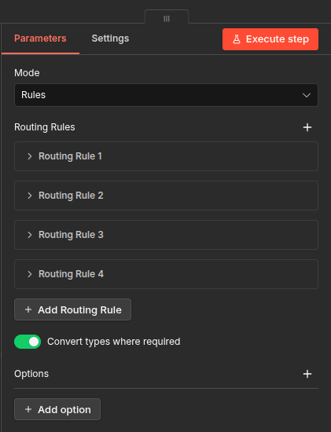
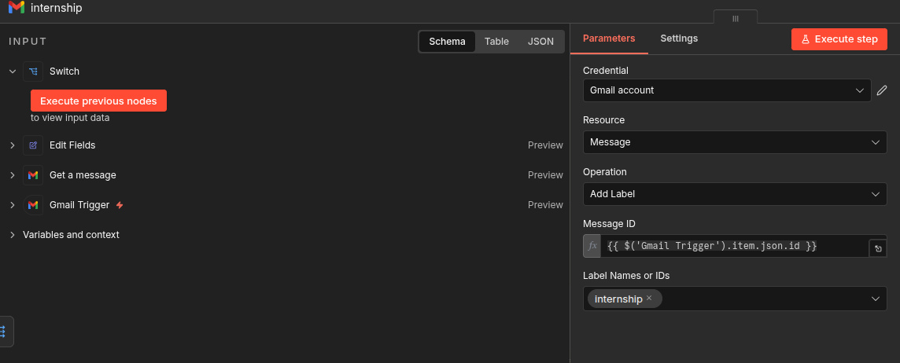

# Gmail Label Workflow — Step-by-Step Guide (n8n)

> **What this workflow does:**  
> Automatically monitors your Gmail inbox every minute and applies one of four labels — **Internship**, **Hackathon**, **Parcel**, or **Loan** — based on keywords found in the email's subject and body.

---

## Prerequisites

Before building this workflow, make sure you have:

- A running n8n instance (self-hosted or cloud)
- A **Gmail OAuth2 credential** configured in n8n (`Settings → Credentials → New`)
- Four **custom labels already created** inside Gmail (Gmail → Settings → Labels → Create new label):
  - `internship`
  - `hackathon`
  - `parcel`
  - `loan`
- The **Label IDs** for each label (find them via Gmail API or by inspecting the label URL)

---

## Workflow Overview



The final workflow looks like the image above. There are **9 nodes** in total:

```
Gmail Trigger → Get a Message → Edit Fields → Switch → [internship / hackathon / parcel / loan]
```

| # | Node | Type |
|---|------|------|
| 1 | Gmail Trigger | Trigger |
| 2 | Get a Message | Gmail – Get |
| 3 | Edit Fields | Set |
| 4 | Switch | Router |
| 5 | internship | Gmail – Add Label |
| 6 | hackathon | Gmail – Add Label |
| 7 | parcel | Gmail – Add Label |
| 8 | loan | Gmail – Add Label |
| 9 | Sticky Note | Documentation |

---

## Step 1 — Create a New Workflow

1. Open your n8n dashboard.
2. Click **"New Workflow"** (top-right or from the Workflows list).
3. Give it a name: `gmail-label`.
4. Click **Save**.

---

## Step 2 — Add the Gmail Trigger Node

This node polls your inbox on a schedule and fires when a new email arrives.

1. Click the **"+"** button on the canvas to add a node.
2. Search for **"Gmail Trigger"** and select it.
3. In the **Parameters** panel:
   - **Credential:** Select your Gmail OAuth2 account (or create one).
   - **Poll Times:** Set to `Every Minute`.
   - **Filters:** Leave empty (triggers on all new emails).
4. Click **Save** / close the panel.

---

## Step 3 — Add the "Get a Message" Node

The trigger gives a message ID; this node fetches the full email content.

1. Click the **"+"** connector coming out of Gmail Trigger.
2. Search for **"Gmail"** and select the **Gmail** node (not trigger).
3. Configure the parameters:
   - **Credential:** Same Gmail OAuth2 account.
   - **Resource:** `Message`
   - **Operation:** `Get`
   - **Message ID:** `={{ $json.id }}`
   - **Simple:** Leave as default.
4. Rename the node to `Get a message`.
5. Click **Save**.

---

## Step 4 — Add the "Edit Fields" Node

This node merges the email's Subject and Body into a single `text` field so it can be pattern-matched in the next step.



1. Click the **"+"** connector from "Get a Message".
2. Search for **"Edit Fields"** (Set node) and select it.
3. In **Parameters**:
   - **Mode:** `Manual Mapping`
   - Click **"Add Field"** and configure:
     - **Field Name:** `text`
     - **Type:** `String`
     - **Value (expression):**
       ```
       {{ ($json.Subject || "") + " " + ($json.textPlain || $json.textHtml || "") }}
       ```
   - This concatenates the Subject and the plain/HTML body into one searchable string.
4. Rename the node to `Edit Fields`.
5. Click **Save**.

> 💡 The expression gracefully falls back to empty strings if any field is missing.

---

## Step 5 — Add the Switch Node

The Switch node routes the email to the correct label node based on keyword matching.



1. Click **"+"** from "Edit Fields".
2. Search for **"Switch"** and select it.
3. In **Parameters**:
   - **Mode:** `Rules`
4. Add **4 Routing Rules** using the **"+ Add Routing Rule"** button:

---

### Routing Rule 1 — Internship

- **Output Label:** `Internship`
- **Condition (Expression):**
  ```
  ={{ /(internship|intern opportunity|intern offer|summer intern|winter intern|trainee)/i.test($json.text) }}
  ```
- **Operator:** `equals`
- **Right Value:** `true`

---

### Routing Rule 2 — Hackathon

- **Output Label:** `Hackathon`
- **Condition (Expression):**
  ```
  ={{ /(hackathon|coding event|dev challenge|buildathon|competition|tech event)/i.test($json.text) }}
  ```
- **Operator:** `equals`
- **Right Value:** `true`

---

### Routing Rule 3 — Parcel or Delivery

- **Output Label:** `Parcel or Delivery`
- **Condition (Expression):**
  ```
  ={{ /(delivery|parcel|shipment|courier|tracking|awb|dispatched)/i.test($json.text) }}
  ```
- **Operator:** `equals`
- **Right Value:** `true`

---

### Routing Rule 4 — Loan/BRCC/MNSSBY/7-Nishchay

- **Output Label:** `Loan/BRCC/MNSSBY/7-Nishchay`
- **Condition (Expression):**
  ```
  ={{ /(loan|emi|credit|pre[- ]?approved|instant loan|personal loan|home loan|loan offer|brcc|mnssby|7[- ]?nishchay)/i.test($json.text) }}
  ```
- **Operator:** `equals`
- **Right Value:** `true`

---

5. Enable **"Convert types where required"** (toggle at the bottom).
6. Rename the node to `Switch`.
7. Click **Save**.

> ⚠️ **Important:** The Switch node checks rules **in order**. An email matching multiple patterns will only go to the **first matched** output.

---

## Step 6 — Add the "internship" Gmail Node

This node applies the Internship label to matched emails.



1. Click **"+"** from the **Internship** output of the Switch node.
2. Search for and add a **Gmail** node.
3. Configure parameters:
   - **Credential:** Your Gmail OAuth2 account.
   - **Resource:** `Message`
   - **Operation:** `Add Label`
   - **Message ID:**
     ```
     ={{ $('Gmail Trigger').item.json.id }}
     ```
     > This references back to the original trigger to get the correct message ID.
   - **Label Names or IDs:** Select or type `internship` (your Gmail label).
4. Rename the node to `internship`.
5. Click **Save**.

> 🔁 Repeat Steps 7–9 for the remaining three label nodes using the same configuration — only the output branch and label name change each time.

---

## Step 7 — Add the "hackathon" Gmail Node

1. Click **"+"** from the **Hackathon** output of the Switch node.
2. Add a **Gmail** node with the same configuration as Step 6, but:
   - **Message ID:** `={{ $json.id }}`
   - **Label Names or IDs:** `hackathon`
3. Rename to `hackathon`.

---

## Step 8 — Add the "parcel" Gmail Node

1. Click **"+"** from the **Parcel or Delivery** output of the Switch node.
2. Add a **Gmail** node with:
   - **Message ID:** `={{ $json.id }}`
   - **Label Names or IDs:** `parcel`
3. Rename to `parcel`.

---

## Step 9 — Add the "loan" Gmail Node

1. Click **"+"** from the **Loan/BRCC/MNSSBY/7-Nishchay** output of the Switch node.
2. Add a **Gmail** node with:
   - **Message ID:** `={{ $json.id }}`
   - **Label Names or IDs:** `loan`
3. Rename to `loan`.

---

## Step 10 — (Optional) Add a Sticky Note

1. Right-click on an empty area of the canvas → **"Add Sticky Note"**.
2. Paste in documentation text, e.g.:
   ```
   ## Gmail Label
   This workflow labels mails in four fields:
   1. Internship
   2. Hackathon
   3. Parcel
   4. Loan
   ```
3. Resize and position it to cover the entire workflow as a backdrop.

---

## Step 11 — Verify Connections

Confirm the node connections match this order:

```
Gmail Trigger
    └──► Get a Message
              └──► Edit Fields
                        └──► Switch
                                  ├──► [Output 0: Internship] ──► internship
                                  ├──► [Output 1: Hackathon]  ──► hackathon
                                  ├──► [Output 2: Parcel]     ──► parcel
                                  └──► [Output 3: Loan]       ──► loan
```

Refer to the complete workflow screenshot at the top of this guide to verify your canvas matches.

---

## Step 12 — Test the Workflow

1. Click **"Execute Workflow"** (top-right red button) to do a manual test run.
2. Send a test email to yourself with a subject like `"Internship Opportunity at XYZ"`.
3. Watch the execution — the correct path should light up green.
4. Check your Gmail to confirm the label was applied.

---

## Step 13 — Activate the Workflow

Once testing passes:

1. Toggle the **"Active"** switch (top-right of the canvas) to turn the workflow **ON**.
2. The workflow will now poll Gmail **every minute** and auto-label incoming emails.

---

## Customization Tips

| What to change | Where to change it |
|---|---|
| Add more keywords | Edit the regex in the Switch node's conditions |
| Add a new category (e.g., "Job Offer") | Add a new Routing Rule in Switch + a new Gmail label node |
| Change poll frequency | Gmail Trigger → Poll Times |
| Handle unmatched emails | Add a fallback output from the Switch node |
| Notify on label applied | Add a Slack/email node after each label node |

---

## Troubleshooting

| Problem | Solution |
|---|---|
| Labels not being applied | Verify the Label ID in each Gmail node matches your actual Gmail label |
| Switch not matching | Check that `$json.text` is populated — inspect Edit Fields output |
| Credential error | Re-authenticate Gmail OAuth2 in Settings → Credentials |
| Workflow not triggering | Make sure the workflow is **Active** and Gmail Trigger is polling |

---

*Built with n8n · Gmail OAuth2 · Regex pattern matching*