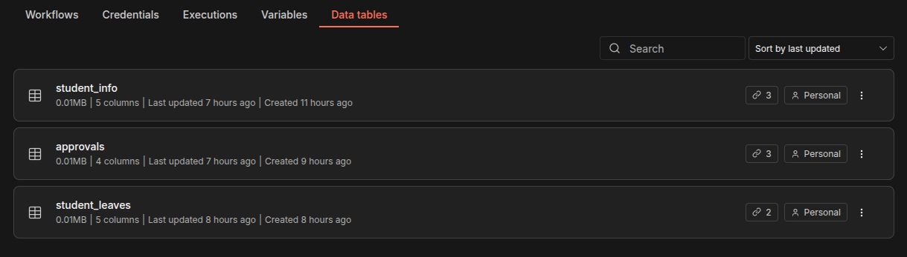
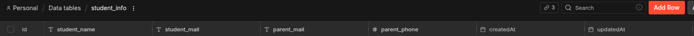
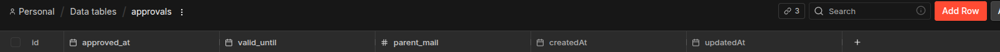
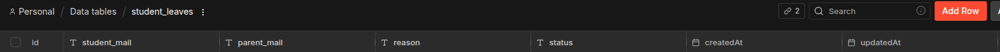
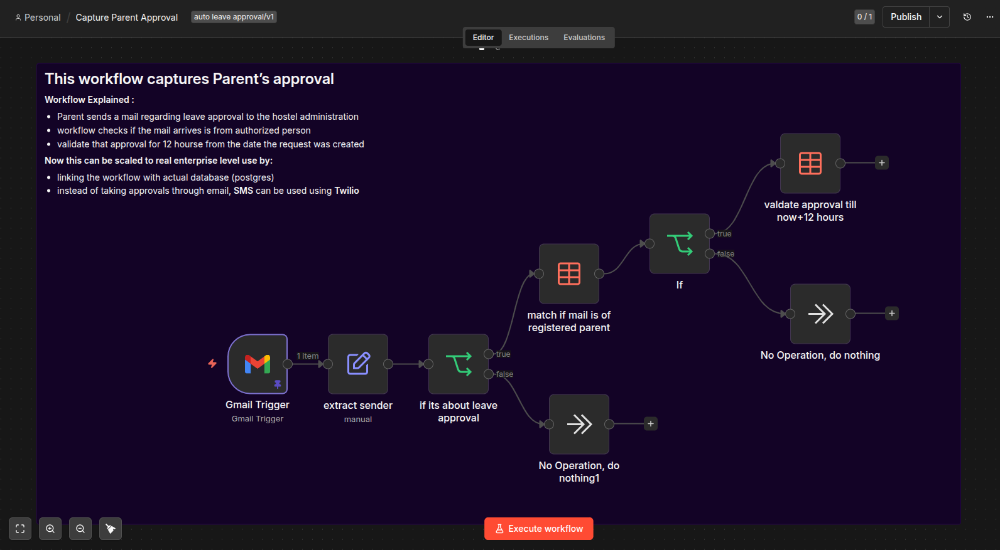
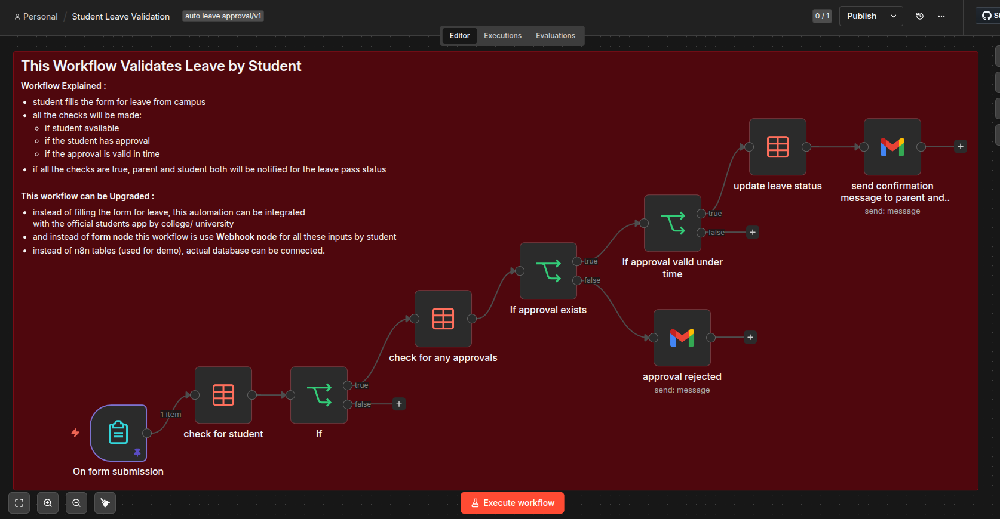

# Auto Leave Approval Workflow Guide

This guide explains the automated process for student leave approvals using n8n workflows and data tables.

## 1. Required Data Tables
To support the workflows, three n8n Data Tables are required to store information and track state:

### Student Info Table (`student_info`)
Stores information about the students and their parents' contact details.

- **Columns**: `id`, `student_name`, `student_mail`, `parent_mail`, `parent_phone`, `createdAt`, `updatedAt`

### Approvals Table (`approvals`)
Records the temporary approvals granted by parents via email.

- **Columns**: `id`, `approved_at`, `valid_until`, `parent_mail`, `createdAt`, `updatedAt`

### Student Leaves Table (`student_leaves`)
Tracks the leave requests submitted by students and their current status.

- **Columns**: `id`, `student_mail`, `parent_mail`, `reason`, `status`, `createdAt`, `updatedAt`

---

## 2. Capture Parent Approval Workflow
This workflow is responsible for capturing and recording the parent's approval via email. It ensures that approvals only come from authorized contacts.

### Step-by-step Process:
1. **Gmail Trigger**: A parent sends an email regarding leave approval to the hostel administration. The workflow triggers automatically upon receiving this email.
2. **Extract Sender**: The workflow extracts the sender's email address from the incoming email.
3. **Leave Approval Check**: A condition node ("if its about leave approval") checks if the email content relates to leave approval.
   - **If False**: The workflow terminates ("No Operation, do nothing1").
   - **If True**: It proceeds to the next step.
4. **Match Registered Parent**: The workflow queries the `student_info` data table to verify if the extracted sender email belongs to a registered parent.
5. **Authorization Check**: An "If" node checks the result of the previous step.
   - **If False** (not an authorized parent): The workflow terminates ("No Operation, do nothing").
   - **If True** (authorized parent): The workflow proceeds to record the approval.
6. **Validate Approval**: An entry is created or updated in the `approvals` table, setting the approval to be valid for the next 12 hours from the current time.

### Scalability & Enterprise Upgrades:
- Instead of using n8n data tables, the workflow can be linked with an actual database like PostgreSQL.
- Instead of taking approvals through email, SMS can be used via Twilio for a faster response.

---

## 3. Student Leave Validation Workflow
This workflow validates the student's leave request against the captured parent approvals in the database.

### Step-by-step Process:
1. **On Form Submission**: The student fills out and submits a form requesting leave from the campus. This form submission triggers the workflow.
2. **Check for Student**: The workflow queries the `student_info` table to verify if the student is registered in the system.
3. **Student Validation**: An "If" node evaluates if the student was found.
   - **If True**: Proceeds to check for parent approvals.
4. **Check for Approvals**: The workflow queries the `approvals` table for the corresponding parent's approval record.
5. **Approval Exists Check**: An "If approval exists" node verifies if a matching approval record was successfully found.
   - **If False**: An email is sent notifying that the leave was rejected ("approval rejected").
   - **If True**: Proceeds to check the time validity of the approval.
6. **Time Validity Check**: An "if approval valid under time" node checks if the current time is within the approval's `valid_until` timeframe (the 12-hour window set in the previous workflow).
   - **If False**: An email is sent notifying that the leave was rejected due to an expired or invalid approval.
   - **If True**: Proceeds to approve the leave.
7. **Update Leave Status**: The workflow creates or updates the leave status in the `student_leaves` table.
8. **Send Confirmation**: A confirmation message is sent via Gmail to both the parent and the student, notifying them of the approved leave pass status.

### Scalability & Enterprise Upgrades:
- Instead of using a basic form for leave, this automation can be integrated with the official college/university students app.
- A Webhook node can be used instead of the n8n form node to handle inputs programmatically from the student app.
- Real databases can be connected instead of using n8n demo tables.
