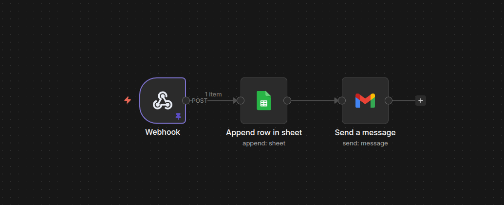
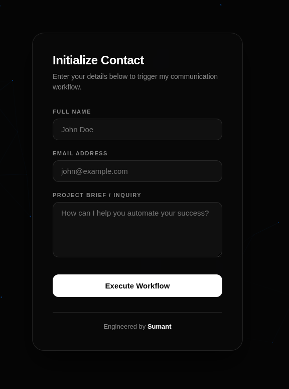
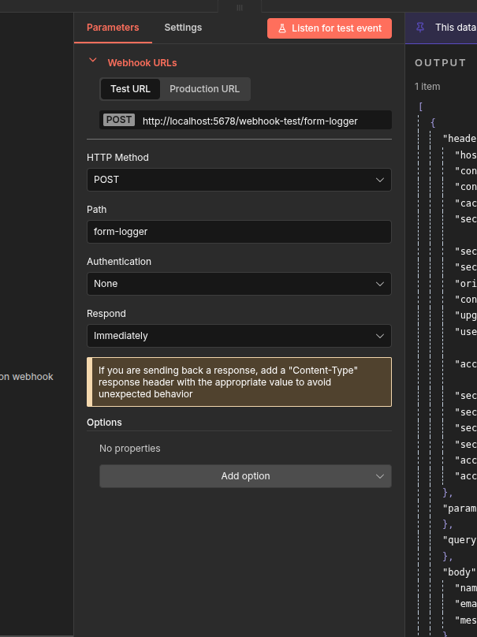
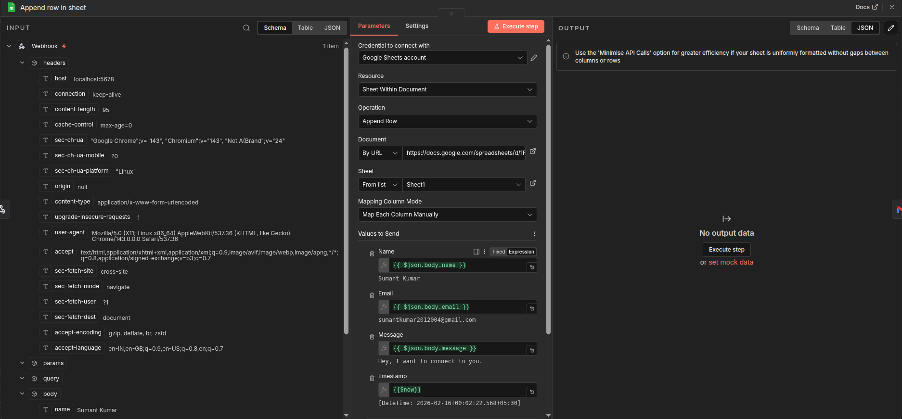
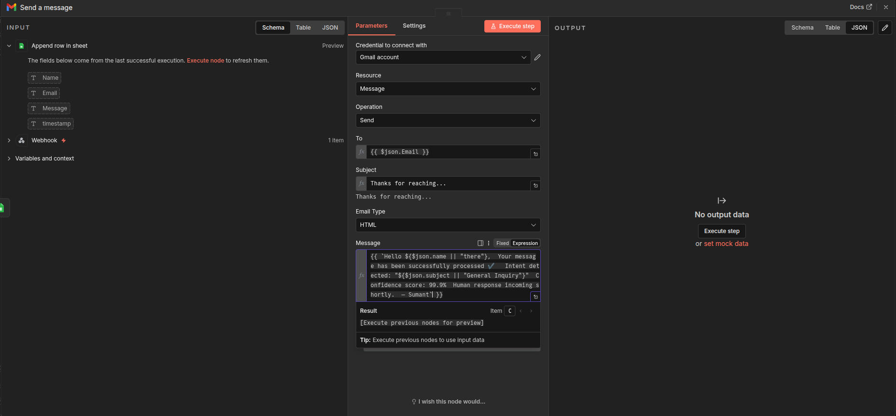

# In this workflow, we will be building a personal Contact form Reply automation to the sender.


When a user submits the contact form:
1. The data is captured using a Webhook  
2. The details are saved into Google Sheets  
3. An automatic reply email is sent back to the sender  

---

## 🚀 Workflow Overview



### Flow Structure

- **Webhook** → Receives form submission (POST request)
- **Append Row in Sheet** → Stores user data in Google Sheets
- **Send a Message (Gmail)** → Sends automated reply email

---

## 🧩 Step 1 — Create the Contact Form UI



Create a simple form with the following fields:

- Full Name
- Email Address
- Project Brief / Inquiry

Example HTML:

```html
<form action="YOUR_WEBHOOK_URL" method="POST">
  <input type="text" name="name" placeholder="Full Name" required />
  <input type="email" name="email" placeholder="Email Address" required />
  <textarea name="message" placeholder="Project Brief / Inquiry"></textarea>
  <button type="submit">Execute Workflow</button>
</form>
```

Replace `YOUR_WEBHOOK_URL` with your generated webhook URL.

---

## ⚡ Step 2 — Configure the Webhook



1. Create a new workflow.
2. Add a **Webhook Trigger**.
3. Set method to `POST`.
4. Copy the generated webhook URL.
5. Paste it inside your HTML form `action`.

This will capture:

- `name`
- `email`
- `message`

---

## 📊 Step 3 — Append Data to Google Sheets



1. Add **Google Sheets → Append Row** node.
2. Connect it to the Webhook.
3. Select:
   - Spreadsheet
   - Sheet name
4. Map fields:
   - Name → `name`
   - Email → `email`
   - Message → `message`

Now every form submission gets saved automatically.

---

## 📧 Step 4 — Send Auto Reply Email



1. Add **Gmail → Send a Message** node.
2. Connect it after Google Sheets.
3. Configure:
   - **To:** `{{email}}`
   - **Subject:** Thank you for reaching out!
   - **Body:**

Example:

```
{{ `Hello ${$json.name || "there"},  Your message has been successfully processed ✔️   Intent detected: "${$json.subject || "General Inquiry"}"  Confidence score: 99.9%  Human response incoming shortly.  — Sumant` }}
```

This sends an instant confirmation email to the user.

---

## 🔁 Final Workflow Structure

```
Webhook → Google Sheets (Append Row) → Gmail (Send Message)
```

---


## 🛠 Tech Stack

- Webhook Automation Platform
- Google Sheets API
- Gmail API
- HTML/CSS

---

## 🎯 Outcome

✔ Saves all submissions in Google Sheets  
✔ Sends automatic confirmation email  
✔ Fully automated  
✔ No backend server required  

---
