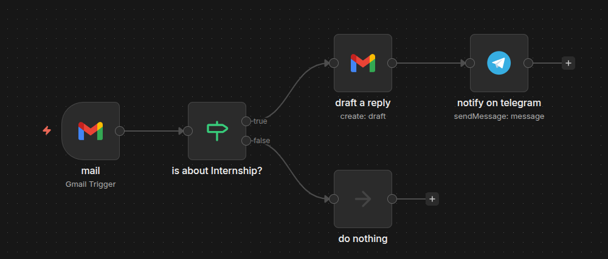
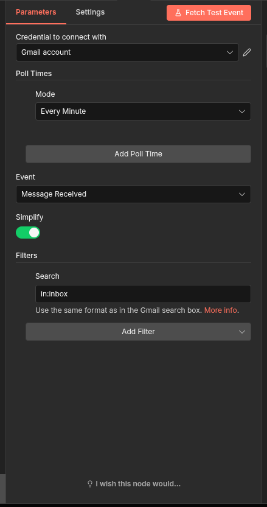
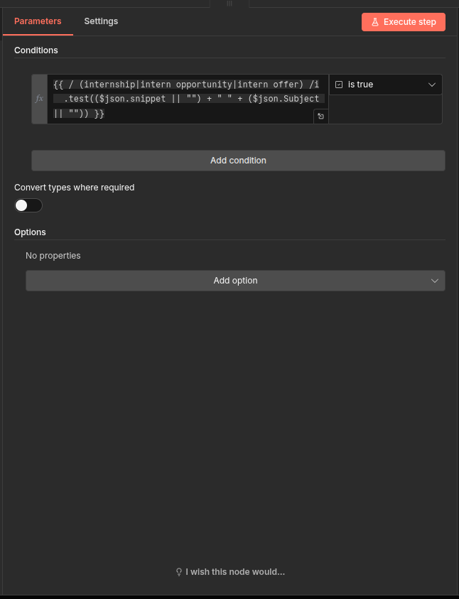
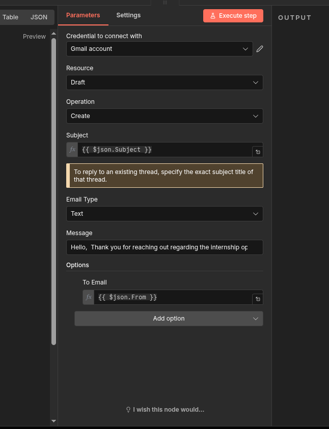
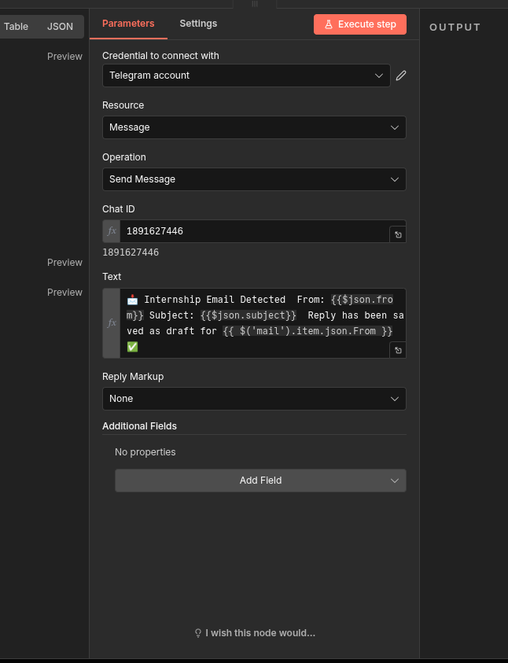

# 📩 Gmail Internship Auto-Reply + Telegram Notification (n8n Workflow)


## 🧩 Workflow Overview



This workflow:

* Watches Gmail inbox
* Detects emails related to **internships**
* Creates a draft reply automatically
* Sends you a Telegram notification
* Ignores non-internship emails

---

## 🧠 Workflow Logic

```
Gmail Trigger
      ↓
Check: Is it about Internship?
      ↓ (true)
Create Draft Reply (Gmail)
      ↓
Send Telegram Notification
```

If condition is false → Do Nothing.

---

# 🚀 Step-by-Step Setup Guide

---

## 1️⃣ Create New Workflow

* Open n8n
* Click **New Workflow**
* Name it:

```
Gmail Internship Auto Reply
```

---

## 2️⃣ Add Gmail Trigger Node

### Node:

`Gmail Trigger`

### Configuration:

**Credential**

* Connect your Gmail account

**Poll Times**

* Mode: `Every Minute`

**Event**

* `Message Received`

**Simplify**

* ✅ Enabled

**Filters → Search**

```
in:inbox
```

This ensures only inbox emails are checked.


> Gmail Trigger polling inbox every minute

---

## 3️⃣ Add IF Node (Check Internship Keywords)

### Node:

`IF`

Rename it:

```
is about Internship?
```

### Condition (Expression Mode)

Click `fx` and paste:

```javascript
{{ 
/(internship|intern opportunity|intern offer)/i
.test(($json.snippet || "") + " " + ($json.Subject || ""))
}}
```

### Set Condition:

```
is true
```

### What This Does

* Combines email subject + snippet
* Checks for:

  * internship
  * intern opportunity
  * intern offer
* Case insensitive
* Returns TRUE or FALSE


> Checking for internship-related keywords in subject and snippet

---

## 4️⃣ TRUE Branch → Create Draft Reply

Add node:

`Gmail`

Rename:

```
draft a reply
```

### Configuration

**Resource**

```
Draft
```

**Operation**

```
Create
```

**Subject**

```
{{ $json.Subject }}
```

⚠️ Important:
Using exact subject keeps the thread linked.

---

### Email Type

```
Text
```

### Message Example

```text
Hello,

Thank you for reaching out regarding the internship opportunity.

I truly appreciate the opportunity and will review the details carefully.

Looking forward to connecting further.

Best regards,
Your Name
```

---

### Options → To Email

Click **Add Option → To Email**

Set:

```
{{ $json.From }}
```

This sends draft reply to the original sender.


> Creating a draft email reply in Gmail keeping the thread alive

---

## 5️⃣ Add Telegram Notification Node

Add node:

`Telegram`

Rename:

```
notify on telegram
```

### Configuration

**Credential**

* Connect your Telegram Bot

**Resource**

```
Message
```

**Operation**

```
Send Message
```

**Chat ID**

```
YOUR_CHAT_ID
```

---

### Text (Expression Mode)

```text
📩 Internship Email Detected

From: {{ $json.From }}
Subject: {{ $json.Subject }}

Reply has been saved as draft.
✅
```

Reply Markup:

```
None
```


> Sending Telegram notification with email snippet details

---

## 6️⃣ FALSE Branch → Do Nothing

From IF node false output:

Add node:

```
No Operation
```

Rename:

```
do nothing
```

This keeps workflow clean.

---

# 🔐 Required Credentials

You must configure:

* Gmail OAuth2
* Telegram Bot Token

---

# 🤖 Telegram Bot Setup (Quick)

1. Open Telegram
2. Search `@BotFather`
3. Create new bot
4. Copy Bot Token
5. Add token inside n8n Telegram credentials
6. Send a message to your bot
7. Get your Chat ID using:

```
https://api.telegram.org/bot<YOUR_BOT_TOKEN>/getUpdates
```

---

# 📌 Final Workflow Structure

```
Gmail Trigger
    ↓
IF (Internship Check)
    ↓ TRUE
Gmail (Create Draft)
    ↓
Telegram (Notify)
    
    ↓ FALSE
No Operation
```

---

# 🧪 How to Test

1. Activate workflow
2. Send yourself an email with subject:

```
Internship Opportunity
```

3. Wait 1 minute
4. Check:

   * Gmail Drafts folder
   * Telegram notification

---

# 🏗 What This Workflow Demonstrates

* Email automation
* Keyword-based filtering
* Automated professional replies
* Real-time admin notification
* Clean branching logic
* Production-ready automation structure

This is not just auto-reply.

This is workflow thinking.

---

# 💡 Upgrade Ideas (Next Level)

* Use AI node to generate smart replies
* Add label "Internship" automatically
* Store email data in Google Sheets
* Send confirmation email to sender
* Add Slack notification
* Log to Notion database

---

# 🎯 Why This Matters

Instead of manually checking emails:

* System filters
* System drafts
* System notifies
* You review & send

Automation reduces reaction time and mental load.

---

# 🏁 Conclusion

This workflow is a small but powerful example of:

> Turning repetitive manual checking into intelligent automation.

Once you understand this pattern, you can automate:

* Job applications
* Client inquiries
* Leads
* Support tickets
* Event registrations

Automation = leverage.

---

Built using n8n ⚡
Maintained by bugOpsX 🚀
