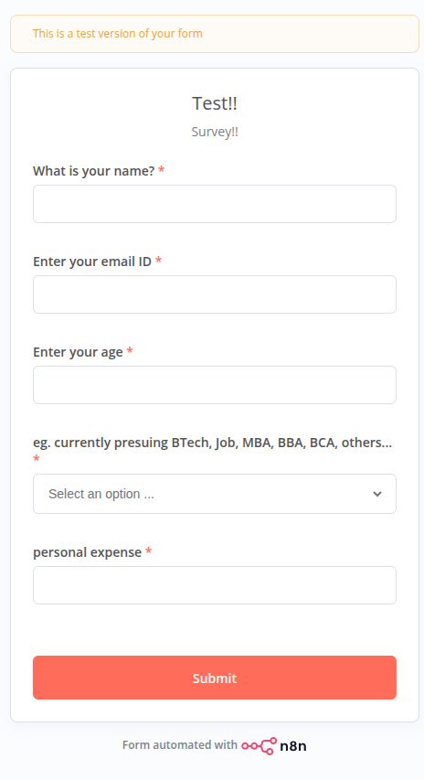
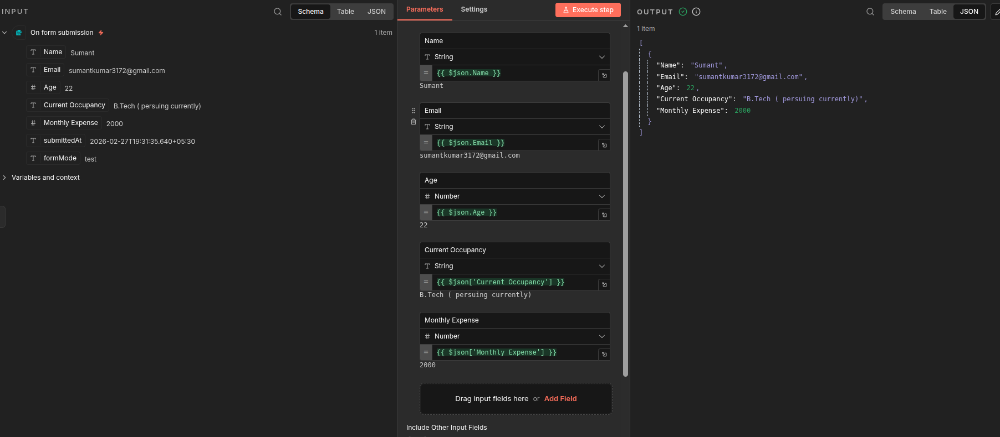
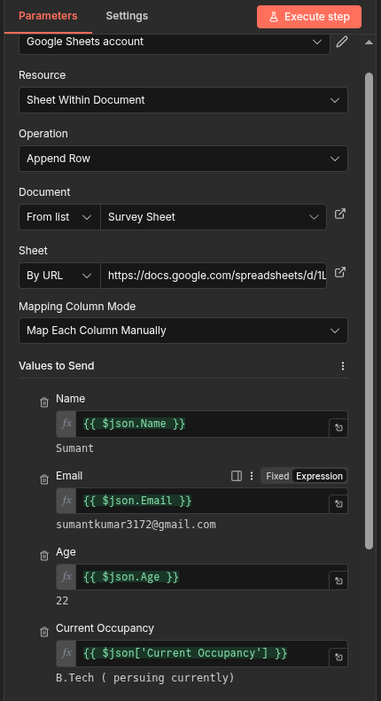
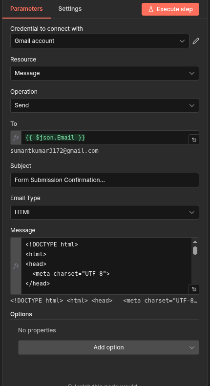
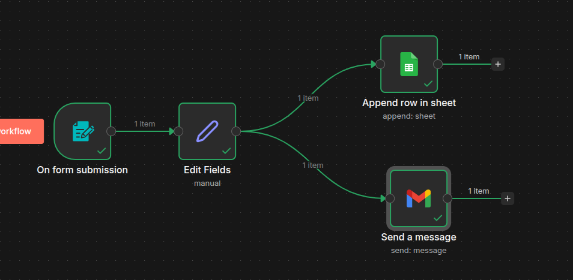

# 🚀 n8n Survey Automation Workflow

This project demonstrates a complete **form-to-automation pipeline** using n8n.

When a user submits the form:

1. Data is captured
2. Processed using an Edit Fields node
3. Stored in Google Sheets
4. Confirmation email is sent automatically

Zero manual work. Fully automated. 🔥

---

## 🧠 Workflow Overview

```
On Form Submission
        ↓
   Edit Fields
      ↙     ↘
Append Row   Send Email
 (Sheets)      (Gmail)
```

---

# 🛠 Step-by-Step Setup Guide

---

## 1️⃣ Create Form Trigger (On Form Submission)

### ➤ Add Node:

* **Node Type:** Form Trigger
* **Trigger:** On Form Submission

### ➤ Add Fields:

| Field Name        | Type     | Required |
| ----------------- | -------- | -------- |
| Name              | String   | ✅        |
| Email             | String   | ✅        |
| Age               | Number   | ✅        |
| Current Occupancy | Dropdown | ✅        |
| Monthly Expense   | Number   | ✅        |

Example dropdown options:

* B.Tech (pursuing currently)
* Job
* MBA
* BBA
* BCA
* Others

### 🖼 Form UI



Once submitted, n8n receives structured JSON data like:

```json
{
  "Name": "Sumant",
  "Email": "example@gmail.com",
  "Age": 22,
  "Current Occupancy": "B.Tech (pursuing currently)",
  "Monthly Expense": 2000
}
```

---

## 2️⃣ Edit Fields Node (Data Structuring)

### ➤ Add Node:

* **Node Type:** Edit Fields (Set Node)
* **Mode:** Manual Mapping

Map fields using expressions:

| Field             | Expression                         |
| ----------------- | ---------------------------------- |
| Name              | `{{ $json.Name }}`                 |
| Email             | `{{ $json.Email }}`                |
| Age               | `{{ $json.Age }}`                  |
| Current Occupancy | `{{ $json["Current Occupancy"] }}` |
| Monthly Expense   | `{{ $json["Monthly Expense"] }}`   |

### 🖼 Set Node Configuration



This ensures clean, consistent structure for downstream nodes.

---

## 3️⃣ Store Data in Google Sheets

### ➤ Add Node:

* **Node Type:** Google Sheets
* **Resource:** Sheet Within Document
* **Operation:** Append Row

### ➤ Setup:

* Connect Google account
* Select spreadsheet (e.g., `Survey Sheet`)
* Choose target sheet

### ➤ Mapping Mode:

`Map Each Column Manually`

Map columns exactly like:

| Sheet Column      | Value                              |
| ----------------- | ---------------------------------- |
| Name              | `{{ $json.Name }}`                 |
| Email             | `{{ $json.Email }}`                |
| Age               | `{{ $json.Age }}`                  |
| Current Occupancy | `{{ $json["Current Occupancy"] }}` |
| Monthly Expense   | `{{ $json["Monthly Expense"] }}`   |

### 🖼 Google Sheets Node



Now every submission is appended as a new row automatically.

---

## 4️⃣ Send Confirmation Email (Gmail Node)

### ➤ Add Node:

* **Node Type:** Gmail
* **Resource:** Message
* **Operation:** Send

### ➤ Configure:

**To:**

```
{{ $json.Email }}
```

**Subject:**

```
Form Submission Confirmation
```

**Email Type:**
HTML

**Message Example:**

```html
<!DOCTYPE html>
<html>
<head>
  <meta charset="UTF-8">
</head>

<body style="margin:0; padding:0; background-color:#f4f6f9; font-family:Arial, sans-serif;">

  <table align="center" width="100%" cellpadding="0" cellspacing="0" style="padding:30px 0;">
    <tr>
      <td align="center">

        <table width="600" cellpadding="0" cellspacing="0" 
               style="background:#ffffff; border-radius:12px; padding:30px; box-shadow:0 4px 12px rgba(0,0,0,0.08);">

          <!-- Header -->
          <tr>
            <td align="center" style="padding-bottom:20px;">
              <h2 style="margin:0; color:#2c3e50;">🎉 Survey Submission Confirmed</h2>
              <p style="color:#7f8c8d; font-size:14px; margin-top:5px;">
                Thank you for participating!
              </p>
            </td>
          </tr>

          <!-- Greeting -->
          <tr>
            <td style="padding:10px 0;">
              <p style="font-size:16px; margin:0;">
                Hi <strong>{{ $json.Name }}</strong>,
              </p>
              <p style="color:#555; line-height:1.6;">
                We’ve successfully received your survey details. Here’s a quick summary:
              </p>
            </td>
          </tr>

          <!-- Info Card -->
          <tr>
            <td>
              <table width="100%" cellpadding="10" cellspacing="0" 
                     style="background:#f9fbfd; border-radius:8px;">

                <tr>
                  <td><strong>Email:</strong></td>
                  <td>{{ $json.Email }}</td>
                </tr>

                <tr>
                  <td><strong>Age:</strong></td>
                  <td>{{ $json.Age }}</td>
                </tr>

                <tr>
                  <td><strong>Currently:</strong></td>
                  <td>{{ $json['Current Occupancy'] }}</td>
                </tr>

                <tr>
                  <td><strong>Personal Expense:</strong></td>
                  <td>₹{{ $json['Monthly Expense'] }}</td>
                </tr>

              </table>
            </td>
          </tr>

          <!-- CTA -->
          <tr>
            <td align="center" style="padding-top:30px;">
              <a href="https://www.linkedin.com/in/sumant01"
                 style="background:#0077B5; color:#ffff; text-decoration:none; padding:12px 25px; border-radius:6px; display:inline-block; font-weight:bold;">
                 Contact on LinkedIn
              </a>
            </td>
          </tr>

          <!-- Footer -->
          <tr>
            <td align="center" style="padding-top:30px; font-size:12px; color:#95a5a6;">
              This is an automated confirmation email.<br>
              Powered by n8n ⚙️
            </td>
          </tr>

        </table>

      </td>
    </tr>
  </table>

</body>
</html>
```

### 🖼 Gmail Node



Now users instantly receive confirmation after submitting the form.

---

## 5️⃣ Final Workflow Structure

### 🖼 Complete Workflow



Flow logic:

* Form triggers workflow
* Edit Fields standardizes data
* Two parallel branches:

  * Store in Sheets
  * Send Email

---

# 🔐 Required Credentials

You must configure:

* Google Sheets OAuth
* Gmail OAuth

Inside:
`Credentials → Add New → Google`

---

# 📦 What This Automation Achieves

✅ Fully automated data collection
✅ Real-time database update
✅ Instant email response
✅ No manual data entry
✅ Scalable system

This is a simple example — but the same structure can scale to:

* Lead generation systems
* College surveys
* Event registrations
* Customer onboarding pipelines
* CRM automation

---

# 🚀 Why This Matters

Instead of:

* Checking emails manually
* Copy-pasting into spreadsheets
* Sending confirmation replies

Everything happens automatically in seconds.

Multiply this logic across business processes and you eliminate repetitive workload entirely.

That’s the power of workflow automation.

---

# 🧩 Future Improvements

* Add validation logic
* Add duplicate email check
* Add conditional routing (Switch node)
* Connect to database (PostgreSQL / MySQL)
* Send Slack/Discord notifications
* Build analytics dashboard

---

# 🎯 Conclusion

This workflow demonstrates how powerful n8n can be for reducing operational workload using simple but smart automation design.

It looks complex.
But implementation is clean and logical.

Automate once.
Benefit forever.

---

**Built with n8n ⚡**
Automation > Repetition
